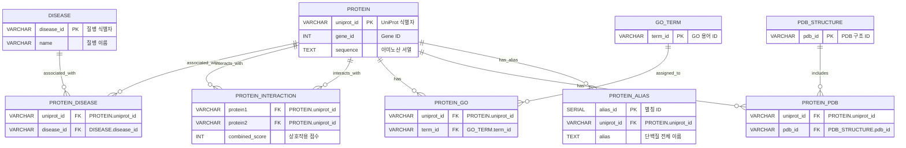

```mermaid
erDiagram
    PROTEIN {
        VARCHAR uniprot_id PK       "UniProt 식별자"
        INT     gene_id             "Gene ID"
        TEXT    sequence           "아미노산 서열"
    }
    DISEASE {
        VARCHAR disease_id PK      "질병 식별자"
        VARCHAR name              "질병 이름"
    }
    PROTEIN_DISEASE {
        VARCHAR uniprot_id FK      "PROTEIN.uniprot_id"
        VARCHAR disease_id FK      "DISEASE.disease_id"
    }
    PROTEIN_INTERACTION {
        VARCHAR protein1 FK        "PROTEIN.uniprot_id"
        VARCHAR protein2 FK        "PROTEIN.uniprot_id"
        INT     combined_score     "상호작용 점수"
    }
    GO_TERM {
        VARCHAR term_id PK         "GO 용어 ID"
    }
    PROTEIN_GO {
        VARCHAR uniprot_id FK      "PROTEIN.uniprot_id"
        VARCHAR term_id FK         "GO_TERM.term_id"
    }
    PDB_STRUCTURE {
        VARCHAR pdb_id PK          "PDB 구조 ID"
    }
    PROTEIN_PDB {
        VARCHAR uniprot_id FK      "PROTEIN.uniprot_id"
        VARCHAR pdb_id FK          "PDB_STRUCTURE.pdb_id"
    }
    PROTEIN_ALIAS {
        SERIAL alias_id PK         "별칭 ID"
        VARCHAR uniprot_id FK      "PROTEIN.uniprot_id"
        TEXT    alias              "단백질 전체 이름"
    }

    PROTEIN ||--o{ PROTEIN_DISEASE : associated_with
    DISEASE ||--o{ PROTEIN_DISEASE : associated_with
    PROTEIN ||--o{ PROTEIN_INTERACTION : interacts_with
    PROTEIN ||--o{ PROTEIN_INTERACTION : interacts_with
    PROTEIN ||--o{ PROTEIN_GO : has
    GO_TERM ||--o{ PROTEIN_GO : assigned_to
    PROTEIN ||--o{ PROTEIN_PDB : has
    PDB_STRUCTURE ||--o{ PROTEIN_PDB : includes
    PROTEIN ||--o{ PROTEIN_ALIAS : has_alias
```
