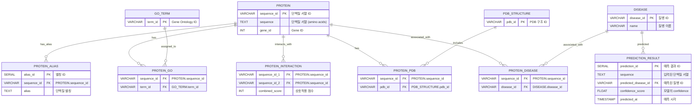

```mermaid
erDiagram
    PROTEIN {
        VARCHAR sequence_id PK       "단백질 서열 ID"
        TEXT    sequence             "단백질 서열 (amino acids)"
        INT     gene_id              "Gene ID"
    }

    DISEASE {
        VARCHAR disease_id PK        "질병 ID"
        VARCHAR name                 "질병 이름"
    }

    PROTEIN_DISEASE {
        VARCHAR sequence_id FK       "PROTEIN.sequence_id"
        VARCHAR disease_id FK        "DISEASE.disease_id"
    }

    PROTEIN_INTERACTION {
        VARCHAR sequence_id_1 FK     "PROTEIN.sequence_id"
        VARCHAR sequence_id_2 FK     "PROTEIN.sequence_id"
        INT     combined_score       "상호작용 점수"
    }

    GO_TERM {
        VARCHAR term_id PK           "Gene Ontology ID"
    }

    PROTEIN_GO {
        VARCHAR sequence_id FK       "PROTEIN.sequence_id"
        VARCHAR term_id FK           "GO_TERM.term_id"
    }

    PDB_STRUCTURE {
        VARCHAR pdb_id PK            "PDB 구조 ID"
    }

    PROTEIN_PDB {
        VARCHAR sequence_id FK       "PROTEIN.sequence_id"
        VARCHAR pdb_id FK            "PDB_STRUCTURE.pdb_id"
    }

    PROTEIN_ALIAS {
        SERIAL alias_id PK           "별칭 ID"
        VARCHAR sequence_id FK       "PROTEIN.sequence_id"
        TEXT    alias                "단백질 별칭"
    }
     PREDICTION_RESULT {
        SERIAL   prediction_id PK    "예측 결과 ID"
        TEXT     sequence            "입력된 단백질 서열"
        VARCHAR  predicted_disease_id FK "예측된 질병 ID"
        FLOAT    confidence_score     "모델의 confidence"
        TIMESTAMP predicted_at        "예측 시각"
    }

    DISEASE ||--o{ PREDICTION_RESULT : predicted
    PROTEIN ||--o{ PROTEIN_DISEASE : associated_with
    DISEASE ||--o{ PROTEIN_DISEASE : associated_with
    PROTEIN ||--o{ PROTEIN_INTERACTION : interacts_with
    PROTEIN ||--o{ PROTEIN_GO : has
    GO_TERM ||--o{ PROTEIN_GO : assigned_to
    PROTEIN ||--o{ PROTEIN_PDB : has
    PDB_STRUCTURE ||--o{ PROTEIN_PDB : includes
    PROTEIN ||--o{ PROTEIN_ALIAS : has_alias

```
